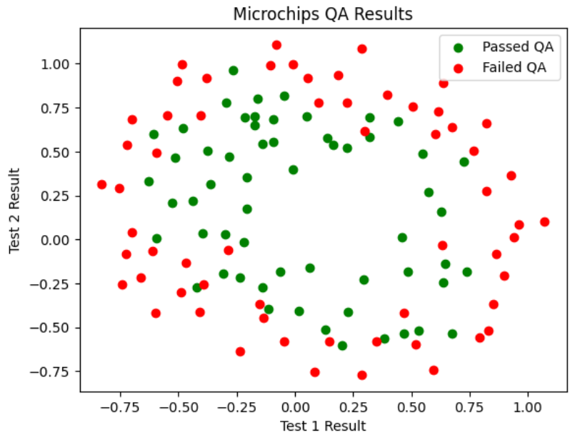

# Microchip-QA-Classification
🔬 ML project using Regularized Logistic Regression and Polynomial Mapping to predict Microchip quality from test results


## Table of Contents  

1. [About](#about)  
2. [Features](#features)  
3. [Requirements](#requirements)  
4. [Installation](#installation)  
5. [Usage](#usage)  

---

## About

The **Microchip Quality Assurance Classifier** is a Python-based machine learning project that implements **Regularized Logistic Regression** from scratch.  
The program predicts whether a microchip should be accepted or rejected based on the results of two different quality assurance (QA) tests.

Since the dataset is not linearly separable, the project demonstrates advanced techniques like **Polynomial Feature Mapping** to create non-linear decision boundaries and **L2 Regularization** to maintain model balance and prevent overfitting.

---
## Features

- **Regularized Logistic Regression**: A custom implementation of the core algorithm including L2 Regularization to prevent overfitting.
- **Polynomial Feature Mapping**: Automatically transforms 2D input features into a high-dimensional space (6th-degree polynomial) to capture non-linear patterns.
- **Momentum-Based Optimization**: An advanced Gradient Descent implementation using Momentum for faster and more stable convergence.
- **Custom Cost Function**: Vectorized implementation of the cost function ($J(\theta)$) with a penalty term for model complexity.
- **Decision Boundary Analysis**: Visualization of complex, non-linear boundaries to evaluate how the model separates "Accepted" from "Rejected" chips.
- **Hyperparameter Tuning**: Easy-to-adjust parameters such as $\lambda$ (Lambda) to explore the trade-off between bias and variance.

---
## Requirements

- **Python 3.x**: The core programming language used for the project.  
- **Jupyter Notebook environment**: VS Code (with Jupyter extension), JupyterLab, or Google Colab to run the `.ipynb` file.  
- **NumPy**: For efficient numerical computations and matrix operations.  
- **Pandas**: For data manipulation and loading the microchip dataset.  
- **Matplotlib**: For generating graphs and visualizing the non-linear decision boundaries.  
- **Git**: To clone the repository.


---
## Installation

### 1. Clone the repository
```bash
git clone https://github.com/Amit-Bruhim/Microchip-QA-Classification.git
```

### 2. Navigate into the project folder
```bash
cd Microchip-QA-Classification
```

### 3. Install required libraries
```bash
pip install numpy pandas matplotlib
```

### 4. Open and Run the Notebook
Open the file `src/microchip_classification.ipynb` using VS Code or upload it to Google Colab.  

> **Note:** If using Google Colab, make sure to upload the dataset from the `data` folder as well.

You can then click **"Run All"** to execute the training and see the results.

*Tip: You don't have to run the code to see the results; you can simply scroll through the notebook to view the pre-saved outputs and graphs.*


---
## Usage

### 1. Initial Data Distribution Visualization
The first step is to visualize the dataset. By plotting Test 1 results against Test 2, we can observe that the two classes (Passed/Failed) cannot be separated by a simple linear line, which justifies the need for feature mapping.


### 2. Training with Polynomial Mapping
The model maps the features into a 6th-degree polynomial space. You can train the model and monitor the cost reduction over iterations to ensure convergence.

### 3. Evaluating the Decision Boundary
Once trained, the model generates a non-linear decision boundary. For example, using $\lambda = 1$ (Optimal Regularization) creates a smooth boundary that balances accuracy and generalization.


### 4. Custom Model Tuning
You can experiment by changing the value of `lambda` in the training function to see how the model overfits ($\lambda = 0$) or underfits ($\lambda = 100$) the data.


---